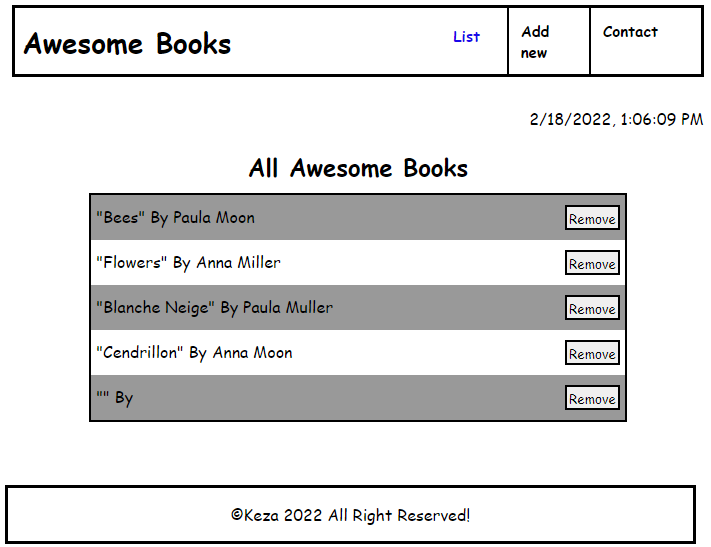

# *Manage books collection*

 >Complete website with navigation.

## Built With

 Major languages
- HTML
- CSS
- JAVASCRIPT

## See Live
[See Live](https://aquamarine-concha-9215bd.netlify.app/#)

## Authors

👤 **Keza**

- GitHub: [Visit my github](https://github.com/keza681)
- Twitter: [Visit my twitter](https://twitter.com/LKeza19)
- LinkedIn: [Linkedin Profile](https://www.linkedin.com/in/linda-keza-a10150218/)

## 🤝 Contributing

Contributions, issues, and feature requests are welcome😉

Feel free to check the [issues page](https://github.com/keza681/Awesome-Books/issues).

## Show your support

Leave a ⭐️ if you like this project!

## Acknowledgments

- Hat tip to anyone whose code was used

## 📝 License

This project is [MIT](./MIT.md) licensed
